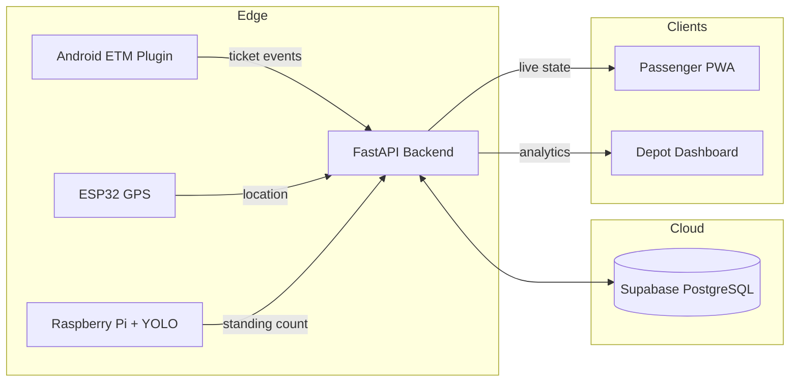

# 🚍 TravelloBus

### Real-time bus occupancy and transit analytics for state road transport


---

> **Occupancy derived from existing electronic ticketing machines rather than cameras — ₹6,000 per bus.**

An ongoing project by Team CityCoders, in development since 2025.

## 🚨 The problem

Commuters boarding a state transport bus have no way to know how full it is until it arrives. Transport authorities, in turn, have no continuous record of how loaded each service actually runs — allocation decisions get made from anecdote and periodic manual surveys.

The obvious fix is camera-based passenger counting. It's also the wrong one for this context: it means new hardware on every bus, continuous video processing, and a privacy exposure that makes public-sector adoption far harder than it needs to be.

## 💡 The approach

Almost every bus in a state fleet already carries an electronic ticketing machine, and every ticket printed on it encodes a boarding and an intended destination. That's an occupancy signal that already exists and costs nothing to collect.

TravelloBus reads those ticket events, maintains a running count of who is aboard and who is due to alight at each upcoming stop, and exposes the result to two audiences — commuters, through a lightweight web app, and depot staff, through an analytics dashboard.

The occupancy engine is deterministic rather than learned. Every number it reports can be traced back to specific ticket events, which matters when the consumer is a public body that may have to defend the figure.

- 🎫 **ETM integration** — ticket events drive boarding and alighting counts
- 📍 **GPS tracking** — location via low-cost ESP32 modules
- 👁️ **Vision assist** — Raspberry Pi + YOLOv8 for standing passengers not captured by seat tickets
- 📱 **Passenger PWA** — route planner, live occupancy band, drop-off projections
- 📊 **Depot dashboard** — fleet overview and ticketing analytics

## 📌 Status

| Component | State |
|---|---|
| ETM simulator → backend → PWA | Working end to end |
| FastAPI backend + Supabase schema | Working |
| Passenger PWA and depot dashboard | Working |
| Android ETM plugin | Designed, not built — needs ETM vendor access |
| ESP32 GPS unit | Designed, not built |
| Raspberry Pi + YOLO vision | Prototype script only |

No bus has run this yet. Occupancy is demonstrated through the ETM simulator rather than live ticketing data, and the cost figures below are design targets, not measurements.

## 🚀 Live demo

- 🌐 **Passenger app:** https://travellobus-app.vercel.app/
- 🎫 **ETM terminal:** https://travellobus-app.vercel.app/etm.html

Issue a few tickets in the ETM terminal and watch occupancy update in the passenger app.

## 🏗️ Architecture



Edge devices buffer locally and sync when connectivity returns, so a bus passing through a dead zone doesn't lose its event history.

## 🛠️ Tech stack

| Layer | Technology | Purpose |
|---|---|---|
| Frontend | JavaScript PWA | Passenger app and map UI |
| Backend | FastAPI (Python) | Async API server |
| Database | Supabase (PostgreSQL) | Event log and live state |
| IoT edge | ESP32 + 4G module | Low-cost GPS tracking |
| Vision | Raspberry Pi + YOLOv8 | Standing passenger detection |
| Ticketing | Android plugin | Integration with existing ETMs |

## ⚙️ Running it locally

```bash
# 1. configure
cp .env.example .env        # then fill in your Supabase URL and publishable key

# 2. create the tables
#    paste backend/schema.sql into the Supabase SQL editor, or:
pip install -r backend/requirements.txt
python scripts/migrate_db.py
python scripts/seed_buses.py

# 3. run the API
cd backend && uvicorn main:app --reload

# 4. serve the frontend (separate terminal)
python scripts/serve_frontend.py
```

Open `index.html` for the passenger app and `etm.html` for the ETM terminal.

The vision prototype is separate:

```bash
pip install -r cv/requirements_cv.txt
python cv/test_yolo.py        # downloads yolov8n weights on first run
```

**Configuration note:** every script reads `SUPABASE_URL` and `SUPABASE_KEY` from the environment and will fail loudly if they're missing. Nothing is hardcoded. The Supabase publishable key is safe to expose in client code *only* when row level security is enabled on your tables — check that before deploying.

## 🔌 API reference

| Endpoint | Method | Description |
|---|---|---|
| `/api/issue_ticket` | `POST` | Registers a new ticket |
| `/api/bus_state/{bus_id}` | `GET` | Current location and occupancy |
| `/api/dropoffs/{bus_id}` | `GET` | Projected drop-offs by stop |

## 🗄️ Database schema

```sql
-- Core event log: one row per ticket printed by the conductor
CREATE TABLE ticket_events (
    id UUID PRIMARY KEY DEFAULT gen_random_uuid(),
    bus_id TEXT NOT NULL,
    origin TEXT NOT NULL,
    destination TEXT NOT NULL,
    ticket_count INT NOT NULL,
    timestamp TIMESTAMPTZ NOT NULL DEFAULT now()
);

-- Single source of truth for each active bus
CREATE TABLE live_bus_state (
    bus_id TEXT PRIMARY KEY,
    total_capacity INT NOT NULL DEFAULT 60,
    occupied_seats INT NOT NULL DEFAULT 0,
    last_updated TIMESTAMPTZ NOT NULL DEFAULT now()
);

-- Drop-off projections per stop
CREATE TABLE bus_dropoffs (
    bus_id TEXT NOT NULL,
    stop_name TEXT NOT NULL,
    dropoff_count INT NOT NULL DEFAULT 0,
    last_updated TIMESTAMPTZ NOT NULL DEFAULT now(),
    PRIMARY KEY (bus_id, stop_name)
);
```

`ticket_events` is append-only; `live_bus_state` is derived from it, so occupancy can always be recomputed from the event log if state drifts.

## 📁 Project structure

```
travellobus/
├── index.html              # Passenger PWA
├── etm.html                # ETM terminal simulator
├── vercel.json             # Deployment config
├── backend/
│   ├── main.py             # FastAPI application
│   ├── schema.sql          # Database schema
│   └── requirements.txt
├── cv/
│   ├── test_yolo.py        # YOLO standing-passenger detection
│   ├── bus_test.jpg        # Test image
│   └── requirements_cv.txt
└── scripts/                # Setup and smoke-test utilities
```

## 💰 Cost per bus

- **Phase 1** — ₹6,000 (ESP32 GPS unit; the ETM plugin is software only)
- **Phase 2** — +₹12,000 (Raspberry Pi and camera)

## 🗺️ Roadmap

- ✅ ETM → backend → PWA pipeline working
- 🔜 Boarding prediction model and demand forecasting
- 🔜 Depot-level fleet reallocation recommendations
- 🔜 Zero-fare scheme reporting for reimbursement substantiation

## 🔍 What we learned

We pitched this to APSRTC up to MD level and were turned down. The stated objection was that publishing occupancy would make visible that supply falls short of demand.

Underneath that sits a harder problem. With almost every bus running full, there is no slack for a passenger to route around — and an information product cannot fix what is actually a supply constraint. The corporation's binding limit is capital, not knowledge.

The lesson we took: the party with the pain (the commuter) and the party with the budget (the corporation) were not the same, and their interests pointed in opposite directions. We'd test that alignment before building next time — and the parts of the system that survive are the ones denominated in the operator's own economics rather than in commuter convenience.

## 🏅 Recognition

- 1st place — Innovesta, KITS (National Science Day project expo)
- 1st place — Prakalp National Level Project Expo, Eluru
- Runners-up — KITS Akshar Gala project expo
- Finalist — V-LaunchPad 2026, VIT-AP University
- Top 5 — SPARK Program, Ratan Tata Innovation Hub
- Presented at SmartAIthon 2026, IEEE Smart Cities AI Hackathon

## 👥 Team

**Team CityCoders**

- K. Lakshmi Balaji
- G. Sumanth
- B. Lakshmi Harshini
- J. Keerthi Sri Sai
- V. Lakshmi Harika

## 📄 Licence

MIT — see [LICENSE](LICENSE).
